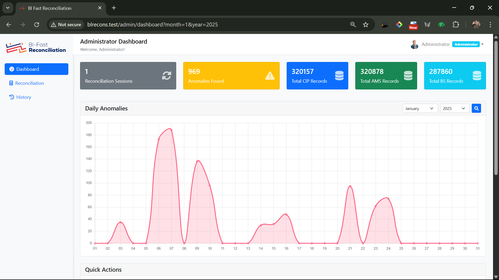

# BI-Fast Reconciliation - Aplikasi Rekonsiliasi BI-FAST


Aplikasi web yang dirancang untuk menyederhanakan dan mengotomatiskan proses rekonsiliasi data transaksi harian, dengan fokus pada transaksi BI-FAST. BI-Fast Reconciliation membantu menghilangkan proses manual yang memakan waktu dan rentan terhadap *human error*.


*<p align="center">Tampilan dashboard utama.</p>*

---

## ✨ Fitur Utama

* **📤 Upload Data Fleksibel**: Unggah data transaksi dari 3 sumber dalam format Excel.
* **⚙️ Rekonsiliasi Otomatis**: logic rekonsiliasi yang membandingkan 3 set data berdasarkan parameter unik dan nominal.
* **⚠️ Deteksi Anomali**: Secara otomatis menemukan dan menandai transaksi yang tidak cocok, hilang, atau memiliki selisih.
* **🚀 Proses Asynchronous**: Untuk data berukuran besar (ribuan hingga jutaan baris), proses rekonsiliasi akan dijalankan di *background* menggunakan antrian (Queue), sehingga tidak membuat browser *timeout*.
* **📊 Dashboard Interaktif**: Visualisasikan hasil rekonsiliasi, lihat ringkasan data anomali harian.
* **🕒 Manajemen Histori**: Semua proses rekonsiliasi yang pernah dilakukan tersimpan dan dapat diakses kembali kapan saja.

---

## 🛠️ Teknologi yang Digunakan

* **Framework**: Laravel 10.x
* **Bahasa**: PHP 8.2
* **Database**: MySQL 
* **Frontend**: Blade, [Bootstrap]
* **Lainnya**: Laravel Queue (untuk proses background)

---

## 🚀 Instalasi dan Setup

Ikuti langkah-langkah berikut untuk menjalankan proyek ini di lingkungan lokal Anda.

1.  **Clone repository ini:**
    ```bash
    git clone https://github.com/AnnisaCitraPratiwi/BI-FastReconciliation.git 
    cd BI-FastReconciliation
    ```

2.  **Install dependensi Composer:**
    ```bash
    composer install
    ```

3.  **Buat file `.env`:**
    ```bash
    cp .env.example .env
    ```

4.  **Generate application key:**
    ```bash
    php artisan key:generate
    ```

5.  **Linked Storage:**
    ```bash
    php artisan storage:link
    ```
    
6.  **Konfigurasi database di file `.env`:**
    ```env
    DB_CONNECTION=mysql
    DB_HOST=127.0.0.1
    DB_PORT=3306
    DB_DATABASE=[NAMA_DATABASE_ANDA]
    DB_USERNAME=[USERNAME_DATABASE_ANDA]
    DB_PASSWORD=[PASSWORD_DATABASE_ANDA]
    ```

7.  **Konfigurasi koneksi Queue di file `.env`:** 
    ```env
    QUEUE_CONNECTION=database
    ```

8.  **Jalankan migrasi dan seeder database:**
    ```bash
    php artisan migrate --seed
    ```

9.  **Jalankan server pengembangan:**
    ```bash
    php artisan serve
    ```

---

## ⚡ Menjalankan Antrian (Queue Worker)

Karena aplikasi ini memproses data besar di *background*, Anda **wajib** menjalankan *queue worker*. Buka terminal baru dan jalankan perintah berikut:

```bash
php artisan queue:work
